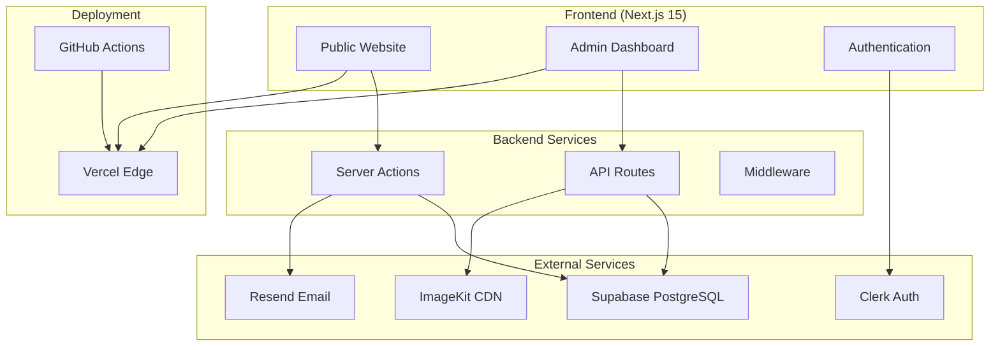
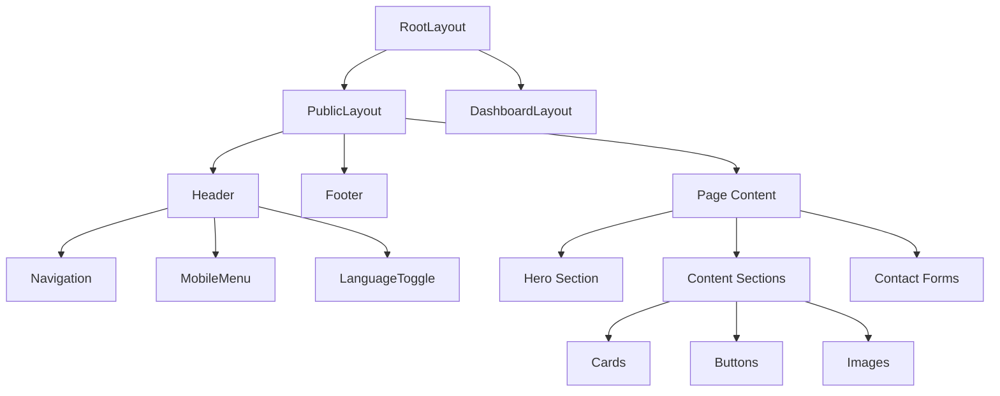
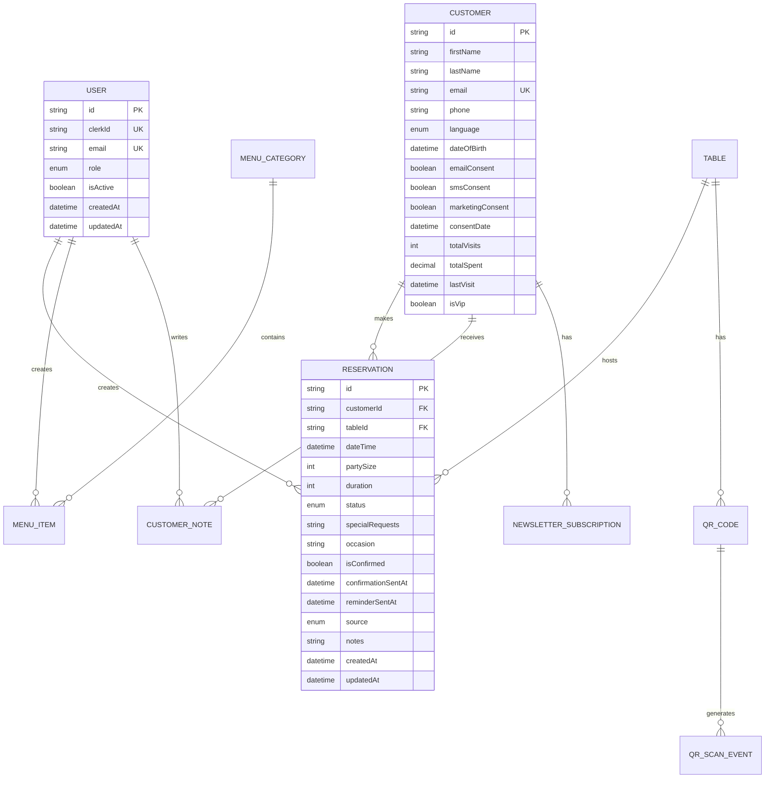
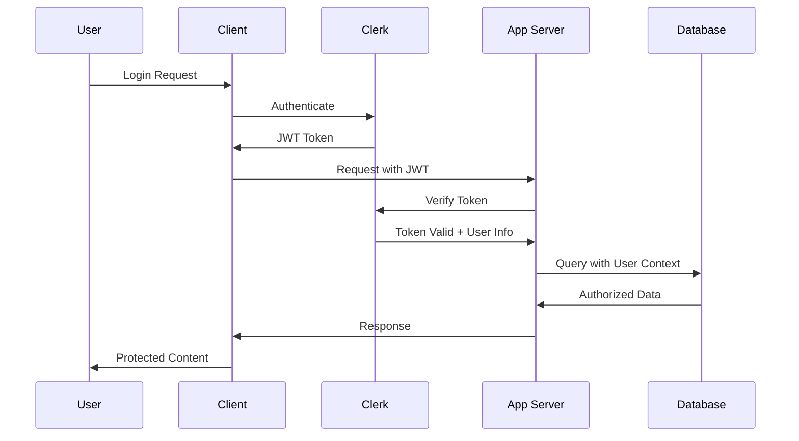
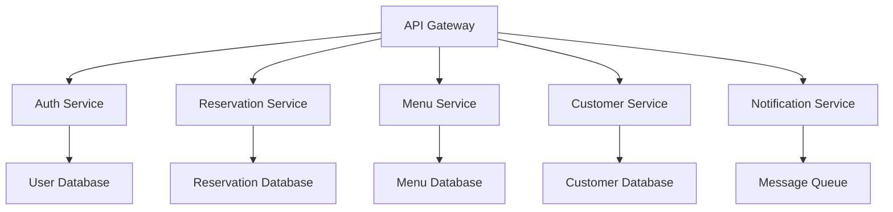

# Architektur-Dokumentation - Strandrestaurant Badezeit

Diese Dokumentation beschreibt die technische Architektur und Designentscheidungen für die Badezeit-Plattform.

## 🏗️ System-Architektur

### High-Level Übersicht



### Technology Stack

#### Frontend Layer
- **Framework**: Next.js 15 (App Router)
- **React**: Version 19.1.0 mit React Server Components
- **TypeScript**: 5.x für Typsicherheit
- **Styling**: Tailwind CSS 4.x mit shadcn/ui
- **State Management**: TanStack Query für Server State
- **Forms**: React Hook Form mit Zod Validation

#### Backend Layer
- **API Pattern**: Server Actions (Next.js 15)
- **Database**: PostgreSQL via Supabase
- **ORM**: Prisma 6.14.0
- **Authentication**: Clerk
- **Email**: React Email + Resend
- **File Storage**: ImageKit CDN

#### Infrastructure Layer
- **Hosting**: Vercel (Edge Runtime)
- **Database**: Supabase (Frankfurt/EU)
- **CDN**: Vercel Edge Network + ImageKit
- **CI/CD**: GitHub Actions
- **Monitoring**: Vercel Analytics

## 🎯 Architektur-Prinzipien

### 1. Performance First
- **Server-Side Rendering**: Statische Generierung wo möglich
- **Edge Computing**: Vercel Edge Runtime für globale Performance
- **Image Optimization**: Next.js Image + ImageKit CDN
- **Bundle Splitting**: Automatische Code-Splitting via Next.js

### 2. Developer Experience
- **TypeScript**: Vollständige Typisierung
- **Hot Reload**: Turbopack für schnelle Entwicklung
- **Linting**: ESLint + Prettier
- **Testing**: Built-in Testing Support

### 3. Security & Privacy
- **GDPR Compliance**: Datenschutz by Design
- **Type Safety**: Runtime Validation mit Zod
- **Authentication**: Secure OAuth via Clerk
- **HTTPS**: Automatisches SSL via Vercel

### 4. Scalability
- **Serverless**: Auto-scaling via Vercel Functions
- **Database**: Connection Pooling via Supabase
- **Caching**: Multiple Caching Layers
- **CDN**: Global Content Distribution

## 🔧 Component Architecture

### Page Structure

```
app/
├── (auth)/              # Authentifizierte Routen
│   ├── sign-in/
│   └── sign-up/
├── (public)/            # Öffentliche Seiten
│   ├── page.tsx         # Homepage
│   ├── ueber-uns/
│   ├── kontakt/
│   ├── speisekarte/
│   ├── galerie/
│   └── reservierung/
├── actions/             # Server Actions
├── api/                 # API Routes
├── globals.css
└── layout.tsx           # Root Layout
```

### Component Hierarchy



### Design System

#### UI Components (shadcn/ui)
```typescript
// Beispiel: Button Component
interface ButtonProps extends React.ButtonHTMLAttributes<HTMLButtonElement> {
  variant?: 'default' | 'destructive' | 'outline' | 'secondary' | 'ghost' | 'link'
  size?: 'default' | 'sm' | 'lg' | 'icon'
  asChild?: boolean
}

const buttonVariants = cva(
  "inline-flex items-center justify-center rounded-md text-sm font-medium transition-colors",
  {
    variants: {
      variant: {
        default: "bg-primary text-primary-foreground hover:bg-primary/90",
        destructive: "bg-destructive text-destructive-foreground hover:bg-destructive/90",
        // ... weitere Varianten
      },
      size: {
        default: "h-10 px-4 py-2",
        sm: "h-9 rounded-md px-3",
        lg: "h-11 rounded-md px-8",
        icon: "h-10 w-10",
      },
    },
    defaultVariants: {
      variant: "default",
      size: "default",
    },
  }
)
```

#### Layout Components
```typescript
// PublicLayout: Wrapper für öffentliche Seiten
export function PublicLayout({ children }: { children: React.ReactNode }) {
  return (
    <div className="min-h-screen flex flex-col">
      <Header />
      <main className="flex-grow">
        {children}
      </main>
      <Footer />
    </div>
  )
}
```

## 🗄️ Data Architecture

### Database Schema Design

#### Entity Relationship Diagram


### Data Flow Patterns

#### 1. Server Actions Pattern
```typescript
// Contact Form Flow
'use server'

export async function sendContactForm(initialState: any, formData: FormData) {
  // 1. Validation mit Zod
  const validatedData = contactSchema.safeParse(formData)
  
  if (!validatedData.success) {
    return { errors: validatedData.error.flatten().fieldErrors }
  }
  
  // 2. Business Logic
  const emailData = prepareEmailData(validatedData.data)
  
  // 3. External Services
  await sendEmail(emailData)
  
  // 4. Database Persistence (optional)
  await logContactSubmission(validatedData.data)
  
  // 5. Response
  return { success: true, message: 'Email sent successfully' }
}
```

#### 2. Real-time Updates (geplant)
```typescript
// Supabase Real-time für Reservierungen
const channel = supabase
  .channel('reservations')
  .on('postgres_changes', 
    { event: 'INSERT', schema: 'public', table: 'reservations' },
    (payload) => {
      // Update UI in Real-time
      setReservations(prev => [...prev, payload.new])
    }
  )
  .subscribe()
```

## 🔐 Security Architecture

### Authentication Flow



### Authorization Patterns

#### Role-Based Access Control
```typescript
// Auth Utility
export async function checkRole(allowedRoles: UserRole[]) {
  const { userId } = auth()
  
  if (!userId) {
    redirect('/sign-in')
  }
  
  const user = await prisma.user.findUnique({
    where: { clerkId: userId },
    select: { role: true, isActive: true }
  })
  
  if (!user?.isActive || !allowedRoles.includes(user.role)) {
    throw new Error('Unauthorized')
  }
  
  return user
}

// Usage in API Routes
export async function POST(request: Request) {
  await checkRole(['ADMIN', 'MANAGER'])
  // Protected logic
}
```

#### GDPR Compliance

```typescript
// Consent Tracking
interface ConsentRecord {
  userId: string
  consentType: 'marketing' | 'analytics' | 'functional'
  consentGiven: boolean
  consentDate: Date
  ipAddress?: string
  userAgent?: string
}

// Data Minimization
const publicCustomerData = {
  select: {
    firstName: true,
    lastName: true,
    // Sensible Daten ausgeschlossen
  }
}
```

## 🎨 Frontend Architecture

### Component Patterns

#### 1. Server vs Client Components

**Server Components** (Default):
```typescript
// Statische Inhalte, SEO-optimiert
export default async function UeberUnsPage() {
  // Server-side Data Fetching
  const teamData = await getTeamData()
  
  return (
    <div>
      <h1>Über uns</h1>
      {teamData.map(member => (
        <TeamMemberCard key={member.id} member={member} />
      ))}
    </div>
  )
}
```

**Client Components** (Interactive):
```typescript
'use client'

// Interaktive Features, State Management
export default function ContactForm() {
  const [state, formAction, pending] = useActionState(sendContactForm, {})
  
  return (
    <form action={formAction}>
      {/* Interactive form elements */}
    </form>
  )
}
```

#### 2. Composition Pattern

```typescript
// Flexible Component Composition
interface PageHeaderProps {
  title: string
  subtitle?: string
  badge?: string
  actions?: React.ReactNode
}

export function PageHeader({ title, subtitle, badge, actions }: PageHeaderProps) {
  return (
    <header className="py-16 text-center">
      {badge && <Badge className="mb-4">{badge}</Badge>}
      <h1 className="hero-title mb-6">{title}</h1>
      {subtitle && <p className="body-text mb-8">{subtitle}</p>}
      {actions && <div className="flex gap-4 justify-center">{actions}</div>}
    </header>
  )
}

// Usage
<PageHeader
  title="Kontakt"
  subtitle="Besuchen Sie uns für unvergessliche kulinarische Erlebnisse"
  badge="📍 Direkt am Strand"
  actions={
    <Button asChild>
      <a href="/reservierung">Jetzt reservieren</a>
    </Button>
  }
/>
```

### State Management

#### 1. Server State (TanStack Query)
```typescript
// Reservations Fetching
function useReservations(date: Date) {
  return useQuery({
    queryKey: ['reservations', date],
    queryFn: () => fetchReservations(date),
    staleTime: 5 * 60 * 1000, // 5 Minuten
  })
}

// Usage
function ReservationsList() {
  const { data: reservations, isLoading } = useReservations(new Date())
  
  if (isLoading) return <Skeleton />
  
  return (
    <div>
      {reservations.map(reservation => (
        <ReservationCard key={reservation.id} reservation={reservation} />
      ))}
    </div>
  )
}
```

#### 2. Client State (React State)
```typescript
// Simple Component State
function LanguageToggle() {
  const [language, setLanguage] = useState<'de' | 'en'>('de')
  
  return (
    <div className="flex gap-2">
      <Button 
        variant={language === 'de' ? 'default' : 'outline'}
        onClick={() => setLanguage('de')}
      >
        Deutsch
      </Button>
      <Button 
        variant={language === 'en' ? 'default' : 'outline'}
        onClick={() => setLanguage('en')}
      >
        English
      </Button>
    </div>
  )
}
```

## 🚀 Performance Architecture

### Caching Strategy

#### 1. Next.js Built-in Caching
```typescript
// Static Generation
export default async function HomePage() {
  // Statically generated at build time
  return <HomepageContent />
}

// Incremental Static Regeneration
export async function generateStaticParams() {
  return [
    { slug: 'ueber-uns' },
    { slug: 'kontakt' },
    { slug: 'speisekarte' },
  ]
}

// Cache Control Headers
export async function GET() {
  const data = await fetchData()
  
  return Response.json(data, {
    headers: {
      'Cache-Control': 'public, s-maxage=60, stale-while-revalidate=300'
    }
  })
}
```

#### 2. Database Query Optimization
```typescript
// Efficient Prisma Queries
const reservationsWithDetails = await prisma.reservation.findMany({
  where: {
    dateTime: {
      gte: startOfDay,
      lt: endOfDay
    }
  },
  select: {
    id: true,
    dateTime: true,
    partySize: true,
    customer: {
      select: {
        firstName: true,
        lastName: true,
        phone: true
      }
    },
    table: {
      select: {
        number: true,
        location: true
      }
    }
  },
  orderBy: {
    dateTime: 'asc'
  }
})
```

### Image Optimization

```typescript
// Next.js Image Component mit ImageKit
import Image from 'next/image'

function RestaurantImage({ src, alt, width, height }: ImageProps) {
  const optimizedSrc = `${src}?tr=w-${width},h-${height},c-maintain_ratio,f-auto`
  
  return (
    <Image
      src={optimizedSrc}
      alt={alt}
      width={width}
      height={height}
      className="object-cover"
      placeholder="blur"
      blurDataURL="data:image/jpeg;base64,..."
    />
  )
}
```

## 🔄 Development Workflow

### Git Workflow

```
main                     # Production Branch
├── develop              # Development Branch
├── feature/contact-form # Feature Branches
├── hotfix/urgent-fix    # Hotfix Branches
└── release/v1.1.0       # Release Branches
```

### CI/CD Pipeline

```yaml
# .github/workflows/ci.yml
name: CI/CD Pipeline

on:
  push:
    branches: [main, develop]
  pull_request:
    branches: [main]

jobs:
  test:
    runs-on: ubuntu-latest
    steps:
      - uses: actions/checkout@v3
      - uses: actions/setup-node@v3
        with:
          node-version: 18
          cache: 'npm'
      
      - run: npm ci
      - run: npm run lint
      - run: npm run type-check
      - run: npm run test        # Wenn Tests vorhanden
      - run: npm run build
      
  deploy-preview:
    if: github.event_name == 'pull_request'
    needs: test
    runs-on: ubuntu-latest
    steps:
      - name: Deploy Preview
        run: vercel deploy --token=${{ secrets.VERCEL_TOKEN }}
        
  deploy-production:
    if: github.ref == 'refs/heads/main'
    needs: test
    runs-on: ubuntu-latest
    steps:
      - name: Deploy Production
        run: vercel deploy --prod --token=${{ secrets.VERCEL_TOKEN }}
```

## 📊 Monitoring & Observability

### Error Tracking

```typescript
// Custom Error Boundary
'use client'

import { useEffect } from 'react'

export default function Error({
  error,
  reset,
}: {
  error: Error & { digest?: string }
  reset: () => void
}) {
  useEffect(() => {
    // Log error to monitoring service
    console.error('Application error:', error)
    
    // In production: Send to error tracking
    if (process.env.NODE_ENV === 'production') {
      // Sentry.captureException(error)
    }
  }, [error])

  return (
    <div className="flex flex-col items-center justify-center min-h-[400px] text-center">
      <h2 className="text-2xl font-bold mb-4">Etwas ist schiefgelaufen!</h2>
      <p className="text-muted-foreground mb-6">
        Ein unerwarteter Fehler ist aufgetreten. Bitte versuchen Sie es erneut.
      </p>
      <Button onClick={reset}>
        Erneut versuchen
      </Button>
    </div>
  )
}
```

### Performance Monitoring

```typescript
// Custom Performance Metrics
export function trackPerformance(metricName: string, value: number) {
  // Web Vitals tracking
  if (typeof window !== 'undefined') {
    // Send to analytics
    gtag('event', 'timing_complete', {
      name: metricName,
      value: Math.round(value)
    })
  }
}

// Usage
useEffect(() => {
  const startTime = performance.now()
  
  // After component loaded
  const endTime = performance.now()
  trackPerformance('component_load_time', endTime - startTime)
}, [])
```

## 🔮 Future Architecture

### Planned Enhancements

#### 1. Real-time Features
- WebSocket Integration für Live-Reservierungen
- Push Notifications für Mitarbeiter
- Live Chat Support

#### 2. Microservices (bei Skalierung)


#### 3. Advanced Analytics
- Customer Behavior Tracking
- Predictive Analytics für Reservierungen
- Revenue Optimization

#### 4. Mobile App (React Native)
- Shared TypeScript Types
- Shared Business Logic
- Native Mobile Features

## 📚 Weitere Ressourcen

### Dokumentation
- [Next.js Documentation](https://nextjs.org/docs)
- [Prisma Documentation](https://www.prisma.io/docs)
- [Tailwind CSS Documentation](https://tailwindcss.com/docs)
- [Vercel Documentation](https://vercel.com/docs)

### Best Practices
- [React Best Practices](https://react.dev/learn)
- [TypeScript Handbook](https://www.typescriptlang.org/docs)
- [GDPR Compliance Guide](https://gdpr.eu/)
- [Web Performance Best Practices](https://web.dev/performance/)

### Tools & Utilities
- [Prisma Studio](https://www.prisma.io/studio) - Database Management
- [Lighthouse](https://lighthouse-metrics.com/) - Performance Auditing
- [React DevTools](https://react.dev/learn/react-developer-tools) - Debugging